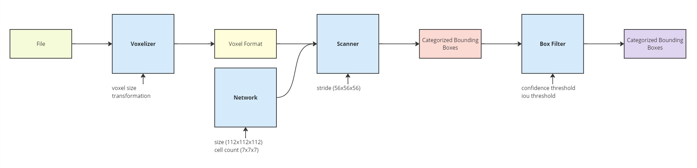
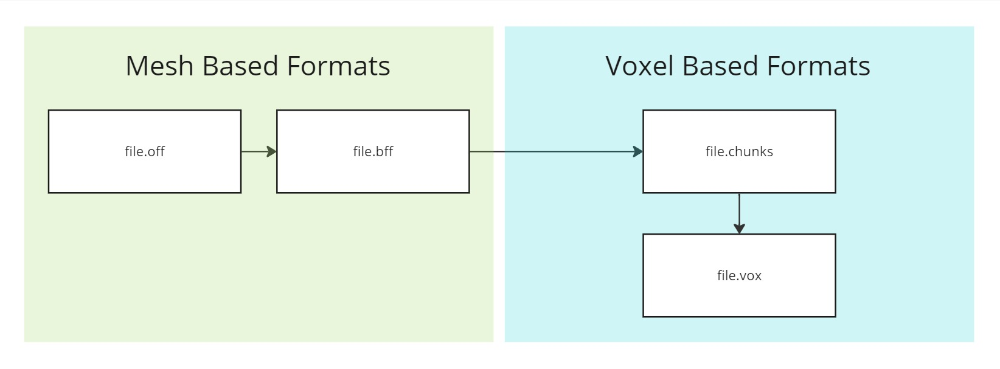

# Yolo3D POC

The aim of this project is to use an approach very similar to YOLO in 2D object recognition on 3D voxel data.

This poses two large challenges

- Adopting the YOLO algorithm for 3D
- Dealing with the large amounts of data that come with the transition to 3D

## Structure

This repository contains multiple applications and one library.
All apps utilize the library to a certain extent.

To get a better understanding of the project, I suggest you check out [app-scan-big-file](./app-scan-big-file) first.
It encapsulates the core idea of the project.

### Applications

Here is a list of all applications in this repository.
For more information check their individual README files.

- [app-create-big-file](./app-create-big-file)

  Can combine multiple models into one large file.
- [app-off-to-bff](./app-off-to-bff)

  Converts an .off file to a .bff file.
- [app-scan-big-file](./app-scan-big-file)

  Scan a big file in chunks to detect objects.
- [app-shuffle-bff](./app-shuffle-bff)

  Shuffles the order of vertices and faces in a .bff file.
- [app-sort-bff](./app-sort-bff)

  Sorts the vertices and faces in a .bff file.
- [app-stats-dataset-psb](./app-stats-dataset-psb)

  Print statistics about the PSB dataset.
- [app-train](./app-train)

  Train a YOLO3D model with a dataset.
- [app-traverse-bff-file](./app-traverse-bff-file)

  Test cache friendliness of a bff file.
- [app-voxelize](./app-voxelize)

  Convert a file to a voxel format.

### Library

The library ([lib](/lib)) contains all reusable code in this project.

### Helper directories

- [boxes](./boxes)

  Contains files that contain a list of bounding boxes detected by scans.
- [sorting](./sorting)

  Contains files used to sort large collections
- [volume](./volume)

  Contains voxelized files

## Process Overview

The whole process of scanning a large file looks as like this. The diagram should be read left to right and the arrows
represent data-flow.

For more details check out the corresponding classes:

- [Voxelizer](lib/src/main/java/nicok/bac/yolo3d/voxelization/Voxelizer.java)
- [Network](lib/src/main/java/nicok/bac/yolo3d/network/Yolo3dNetwork.java)
- [Scanner](lib/src/main/java/nicok/bac/yolo3d/scanner/Scanner.java)
- [BoxFilter](lib/src/main/java/nicok/bac/yolo3d/BoxFilter.java)

## File Formats

It is also important to understand that not every file format is suited for scanning. 
Some must be converted first.

The following diagram shows the currently implemented conversions.

In general, `.chunks` are recommended for scanning.
However, this is just a recommendation for performance.
Feel free to implement scanning for any other type as you please.

